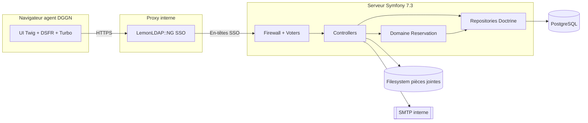
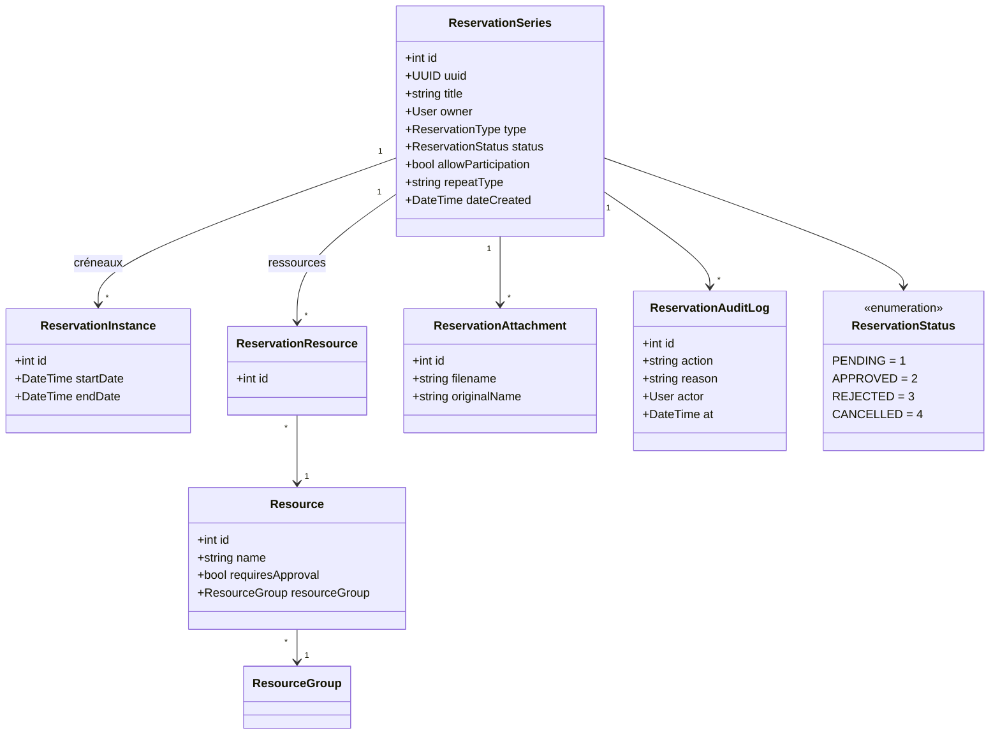
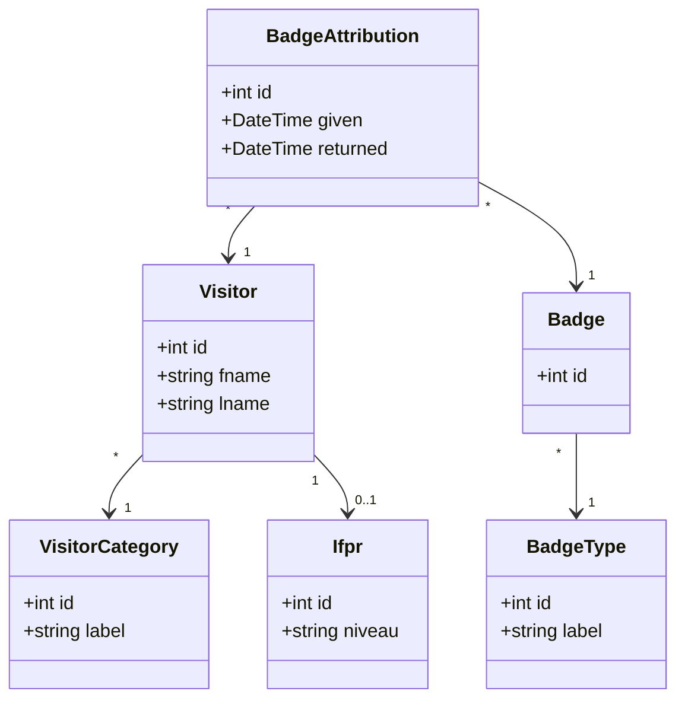
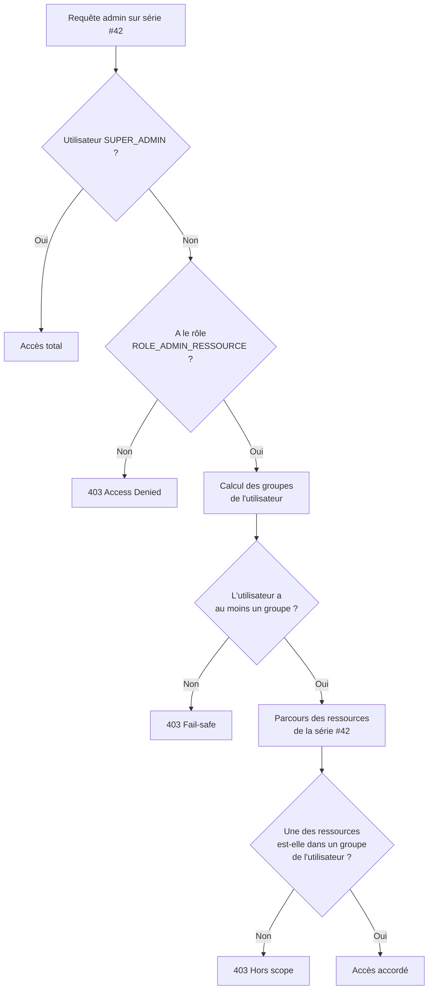
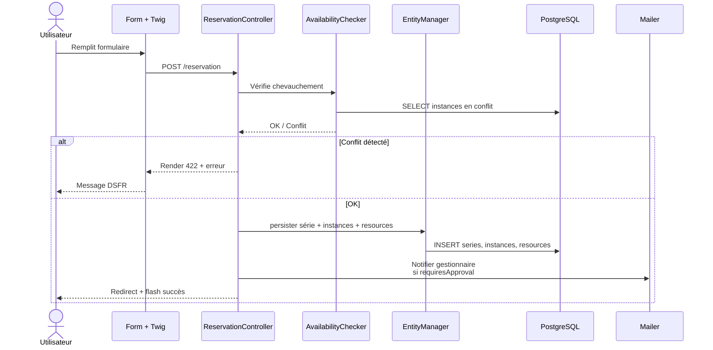
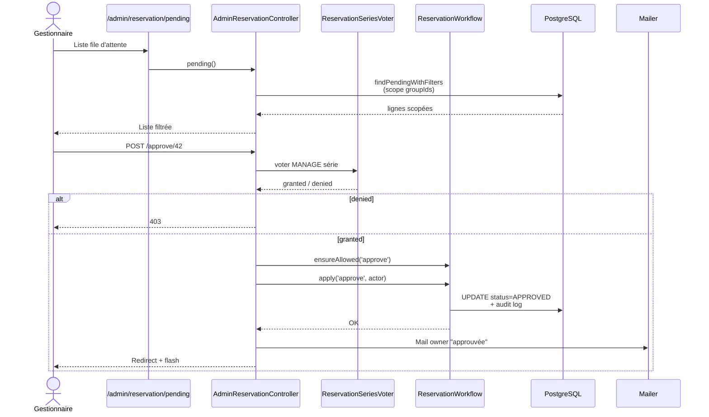

# booking-D — Architecture & vue d'ensemble

> **Public visé** : développeurs de la DGGN, chefs de projet, hiérarchie technique.
> **Dernière mise à jour** : 2026-04-21
> **Statut** : document vivant, toute évolution structurelle doit y être reflétée avant merge.

---

## 1. À quoi sert `booking-D`

`booking-D` est l'application de **réservation de ressources matérielles** de la DGGN. Elle remplace et consolide plusieurs fichiers Excel, mails et calendriers partagés qui servaient à réserver des **salles**, des **amphis**, des **véhicules** et, à terme, toute autre ressource matérielle dont l'allocation pose problème quand plusieurs personnes la veulent au même moment.

Ce qui relève de `booking-D` :

- Déclarer une ressource physique (salle, véhicule, etc.), la rattacher à un groupe, lui associer des créneaux d'ouverture, des plans/agencements (layouts), des règles d'approbation.
- Permettre à un agent de **demander** un créneau sur une ou plusieurs ressources, éventuellement de façon récurrente, avec pièces jointes.
- Faire **valider ou refuser** la demande par un gestionnaire de la ressource, de façon scopée (un gestionnaire d'amphis ne voit ni ne touche aux demandes de véhicules).
- Gérer les **visiteurs** (déclaration, attribution de badge, fiche IFPR) et produire des **statistiques** de fréquentation.

Ce qui **ne relève pas** de `booking-D` — et ce point est volontairement cadré : voir ADR `02-adr-separation-prestation-reservation.md`.

---

## 2. Origine du modèle de données

Le schéma de base de données de `booking-D` **n'a pas été conçu de zéro** : il est repris du projet open-source **LibreBooking** (ex-phpScheduleIt / Booked), outil PHP de réservation de salles largement utilisé dans le monde universitaire et associatif. L'équipe a :

- extrait la structure des tables de LibreBooking (`reservation_series`, `reservation_instances`, `reservation_resources`, `reservation_statuses`, etc.) ;
- l'a **ré-implémentée en PostgreSQL** (LibreBooking cible historiquement MySQL) ;
- l'a **mappée en entités Doctrine** pour intégration Symfony 7.3 ;
- l'a étendue avec des spécificités DGGN : `ResourceGroup`, scope par groupe, pièces jointes, audit log, blackouts, visiteurs/badges, IFPR.

**Conséquences pratiques à connaître :**

- Certains champs sont hérités et portent la marque de l'origine : la propriété `legacyid` de `ReservationSeries` sert à retrouver une ligne migrée depuis une instance LibreBooking historique. Elle est `nullable` et peut rester vide pour toute série créée nativement dans `booking-D`.
- Les **IDs de `ReservationStatus`** (1/2/3/4) sont des valeurs **stables** reprises du modèle LibreBooking. Les modifier casserait la compatibilité de données migrées et les constantes PHP qui les référencent.
- Le vocabulaire (`Series`, `Instance`, `Resource`) reflète la terminologie LibreBooking, d'où l'importance du glossaire `docs/03-glossaire.md` : on a gardé le vocabulaire d'origine pour limiter la surface de réécriture, au prix d'une petite courbe d'apprentissage pour le nouveau dev.
- Certains choix d'implémentation portent la mention *"LibraBooking-friendly"* dans le code (ex: le motif de refus n'est pas persisté sur la série elle-même mais dans l'audit log, ce qui reste compatible avec le schéma d'origine).

**Pourquoi c'est important pour l'évolution du produit.** Le schéma a été pensé par une communauté avec une logique précise : réservation de ressources matérielles allouées sur créneaux. Le tordre pour y faire entrer un domaine différent (cf. Prestation, ADR 001) reviendrait à jeter la cohérence métier qui a fait la solidité de LibreBooking depuis plus de 15 ans. Toute évolution doit **prolonger** la logique LibreBooking, pas la contredire.

---

## 3. Contraintes structurantes

Plusieurs contraintes conditionnent tous les choix qui suivent. Elles doivent être gardées à l'esprit avant de proposer une évolution :

**Environnement fermé.** Le serveur de production est sur un réseau interne de la gendarmerie, sans accès Internet sortant. Les dépendances doivent être vendorées, les assets compilés en local, le déploiement se fait par `rsync` / `scp` depuis un poste de build. Aucune CDN publique n'est atteignable à l'exécution.

**SSO obligatoire.** L'authentification passe par **LemonLDAP::NG** (portail SSO interne). L'application ne gère ni inscription, ni mot de passe, ni reset. Un `LemonLdapAuthenticator` custom récupère les en-têtes HTTP positionnés par le proxy LemonLDAP et instancie l'utilisateur correspondant.

**DSFR.** L'interface respecte le Système de Design de l'État Français. Les composants (alertes, formulaires, boutons, tableaux) sont fournis par le bundle `radicaldingos/dsfr-form-theme-bundle` et la CSS DSFR. Éviter de réinventer des composants hors DSFR : cela casse l'homogénéité attendue par les services de l'État.

**Turbo Drive actif.** La navigation utilise Turbo (`symfony/ux-turbo`). Cela a deux conséquences concrètes :

- Les formulaires qui retournent des erreurs de validation doivent répondre en **HTTP 422**, sinon Turbo ignore le corps de la réponse.
- Les scripts qui manipulent le DOM (ex. FullCalendar) doivent vivre dans le `body` et s'accrocher aux événements `turbo:load` / `turbo:before-cache` pour survivre aux navigations.

**PostgreSQL.** La base de production est PostgreSQL 17/18. Le schéma est géré par Doctrine Migrations, jamais par `doctrine:schema:update`. Certaines données de référence (statuts, types) ne sont pas dans les migrations et doivent être seedées manuellement au déploiement (cf. `requet.start.txt`).

---

## 4. Stack technique

| Couche | Choix | Version | Justification |
|---|---|---|---|
| Langage | PHP | 8.3 | Requis par Symfony 7.4 ; types natifs, readonly properties, attributs. |
| Framework | Symfony | 7.4.* (LTS) | Version LTS officielle — bug fixes jusqu'en novembre 2028, correctifs de sécurité jusqu'en novembre 2029. Écosystème stable, conformité État. |
| ORM | Doctrine ORM | 3.6 | Standard Symfony, migrations, QueryBuilder. |
| SGBD | PostgreSQL | 17/18 | Fiabilité, contraintes d'intégrité, support des transactions longues. |
| SSO | LemonLDAP::NG | — | Imposé par l'environnement DGGN. |
| Front | Twig + Turbo + Stimulus | Turbo 2.35 | Navigation fluide, peu de JS, rendu serveur. |
| Design | DSFR | — | Obligation État. |
| Calendrier | FullCalendar + tattali/calendar-bundle | 7.0 | Rendu interactif, déjà intégré. |
| PDF | DomPDF | 3.1 | Génération de badges, attestations. |
| Uploads | VichUploader | 2.9 | Pièces jointes de réservation. |
| Tests | PHPUnit | 12.5 | Tests unitaires et fonctionnels. |

Les dépendances complètes sont figées dans `composer.lock` et `package-lock.json`.

---

## 5. Vue d'ensemble



L'application n'expose aucune API publique. Les endpoints `/api/*` existants sont réservés à des appels AJAX internes (calendrier, disponibilité).

---

## 6. Modèle de domaine

Le domaine est découpé en plusieurs **contextes bornés** (bounded contexts au sens DDD) :

- **Réservation** : demander et valider l'usage d'une ressource sur un créneau.
- **Ressource** : catalogue des salles, véhicules, etc., avec leurs groupes, leurs catégories, leurs plans.
- **Accueil / Visiteurs** : déclaration de visiteurs, IFPR, badges.
- **Utilisateurs & rôles** : vue mince, l'identité vient de LemonLDAP.

### 6.1 Contexte Réservation



**Clé de lecture** : une **Series** est UNE demande. Les **Instances** sont les créneaux concrets (une résa hebdomadaire sur 10 semaines = 10 instances). Les **ReservationResource** sont la table de jointure vers les ressources réservées. Le statut est porté au niveau de la Series (pas de l'instance) — on valide ou on refuse l'ensemble.

**Règle métier confirmée** : une Series porte sur des ressources **d'un seul et même groupe** (pas de mix amphi + véhicule dans une même demande). Cette règle simplifie les voters et doit être préservée.

### 6.2 Contexte Ressource


**Clé de lecture** : `ResourceGroup` est le pivot du **scope** administratif. Un utilisateur avec `ROLE_ADMIN_RESSOURCE` peut gérer uniquement les ressources des groupes auxquels il est rattaché. C'est ce qui permet de distinguer l'admin "amphis" de l'admin "véhicules".

### 6.3 Contexte Accueil



Ce contexte est **indépendant** de la réservation : aucun lien direct entre un `Visitor` et une `ReservationSeries`. Un visiteur peut venir sans qu'aucune salle ne soit réservée (rendez-vous d'accueil, convocation, etc.).

---

## 7. Rôles et autorisations

### 7.1 Hiérarchie des rôles

Définie dans `config/packages/security.yaml` :

```yaml
role_hierarchy:
    ROLE_AGENT_ACCUEIL:   [ ]                        # Donne/Reprend badge
    ROLE_ADMIN_RESSOURCE: [ ]                        # Gère SES ressources
    ROLE_ADMIN_BADGE:     [ ROLE_AGENT_ACCUEIL ]     # Crée les badges + hérite accueil
    ROLE_SUPER_ADMIN:
        - ROLE_ADMIN
        - ROLE_ADMIN_RESSOURCE
        - ROLE_ADMIN_BADGE
        - ROLE_ALLOWED_TO_SWITCH
```

Deux observations structurantes :

`ROLE_ADMIN_RESSOURCE` **n'hérite pas** de `ROLE_ADMIN` : c'est voulu. Les contrôleurs admin legacy restent protégés par `ROLE_ADMIN` ; le nouveau monde scopé utilise `ROLE_ADMIN_RESSOURCE` + voters. Cette séparation évite qu'un gestionnaire de salles ait accès à la liste des utilisateurs ou à la configuration globale.

`ROLE_ADMIN_BADGE` hérite de `ROLE_AGENT_ACCUEIL` : un admin badge peut physiquement remettre un badge, c'est normal.

**Retrait du `ROLE_ADMIN_PRESTA` (avril 2026).** Le rôle a été **physiquement supprimé** de `security.yaml` et de `UserRoleType`. Il n'existait que pour préparer une future application Prestations que ce dépôt ne portera **jamais** (voir ADR `02`). Le garder "en dormance" aurait été mensonger : `booking-D` n'est techniquement pas conçu pour les prestations à la personne (pas de grille tarifaire, pas de confidentialité médicale RGPD renforcée, pas de gestion de praticien). L'application Prestations, si elle voit le jour, sera un produit indépendant qui déclarera **son propre** rôle, sans compromis hérité.

### 7.2 Matrice d'accès par module

| Module / action | USER | AGENT_ACCUEIL | ADMIN_BADGE | ADMIN_RESSOURCE (scopé) | SUPER_ADMIN |
|---|:---:|:---:|:---:|:---:|:---:|
| Voir le calendrier public | ✅ | ✅ | ✅ | ✅ | ✅ |
| Déclarer une réservation | ✅ | ✅ | ✅ | ✅ | ✅ |
| Voir SES propres réservations | ✅ | ✅ | ✅ | ✅ | ✅ |
| Voir détail d'une résa (autre owner) | ❌ | ❌ | ❌ | ✅ si groupe | ✅ |
| Approuver / refuser / annuler | ❌ | ❌ | ❌ | ✅ si groupe | ✅ |
| Gérer les ressources / groupes | ❌ | ❌ | ❌ | ✅ si groupe | ✅ |
| Consulter IFPR | ❌ | ✅ | ✅ | ❌ | ✅ |
| Créer / modifier IFPR | ❌ | ❌ | ✅ | ❌ | ✅ |
| Attribuer un badge | ❌ | ✅ | ✅ | ❌ | ✅ |
| Configurer les types de badge | ❌ | ❌ | ✅ | ❌ | ✅ |
| Statistiques visiteurs | ❌ | ✅ | ✅ | ❌ | ✅ |
| Gérer les utilisateurs | ❌ | ❌ | ❌ | ❌ | ✅ |

**"Scopé"** signifie : l'utilisateur ne voit et ne peut agir que sur les ressources appartenant à un `ResourceGroup` dont il est membre. Détail technique en section 8.

### 7.3 Deux couches de défense

Le projet applique systématiquement **deux gardes** indépendantes :

**Couche 1 — Firewall / `access_control`** : grossière, au niveau URL. Empêche un non-authentifié ou un rôle trop faible d'approcher la route. Configurée dans `security.yaml`.

**Couche 2 — Voters applicatifs** : fine, au niveau de l'objet. Une fois la route atteinte, le voter tranche sur l'instance précise (cette série, cette ressource). Localisés dans `src/Security/Voter/`.

Cette redondance est volontaire : si un développeur oublie de déclarer un `access_control` sur une nouvelle route, le voter rattrape sur l'action sensible. Inversement, si un voter est mal invoqué, le firewall évite au moins le pire.

---

## 8. Scope par `ResourceGroup` — l'invariant

C'est le mécanisme qui fait qu'un gestionnaire d'amphis ne peut pas approuver de demande véhicule. Il s'appuie sur la relation `ManyToMany` existante entre `User` et `ResourceGroup`.

### 8.1 Lecture (listings)

Dans les méthodes d'index et de file d'attente du `AdminReservationController`, on calcule l'ensemble des identifiants de groupes de l'utilisateur via `scopedGroupIds()` :

- retourne `null` pour un `ROLE_SUPER_ADMIN` → aucun filtre ajouté, il voit tout.
- retourne `[]` pour un admin ressource sans groupe → le filtre `IN ()` ne matche rien → il ne voit rien (fail-safe).
- retourne `[id, …]` sinon → on ajoute `WHERE resource.resourceGroup IN (:ids)` dans le repository.

Cette logique vit dans `ReservationSeriesRepository::findPendingWithFilters()` et `findAllWithFilters()`, côté requête principale **et** côté requête de comptage (sinon la pagination mentirait).

### 8.2 Écriture (actions sur un objet)

Pour `show`, `download`, `approve`, `reject`, `cancel`, on délègue à deux voters :

- `ReservationSeriesVoter::VIEW_DETAILS` — l'owner OU un gestionnaire du groupe.
- `ReservationSeriesVoter::MANAGE` — super-admin OU gestionnaire d'au moins un groupe associé à une ressource de la série.

La règle "une série = ressources d'un seul groupe" rend le "au moins un" équivalent à "toutes", ce qui simplifie la vérification.

### 8.3 Diagramme de décision



---

## 9. Flux métier principaux

### 9.1 Créer une réservation



Points de vigilance : la validation côté client (dates min, cohérence début/fin) est uniquement un garde-fou UX. **Toute règle métier est revalidée côté serveur**. Le retour en 422 est nécessaire pour que Turbo remplace le DOM.

Côté serveur, deux services cohabitent :

- `App\Service\AvailabilityChecker` est invoqué depuis le contrôleur utilisateur lors de la création d'une série. Il porte la logique de détection de conflit sur le formulaire.
- `App\Domain\Reservation\AvailabilityService` est le service de plus bas niveau utilisé notamment par le calendrier et les vues API (fenêtres libres, index des créneaux occupés). Il délègue au `ResourceRulesChecker`.

Les deux ne font pas exactement la même chose : le premier est orienté "ce formulaire est-il valide ?", le second est orienté "quels créneaux sont libres pour affichage ?". Ne pas les confondre.

### 9.2 Valider une demande



Le motif de refus est **persisté dans `reservation_audit_logs`** (pas dans la série elle-même), ce qui préserve l'historique si la série évolue.

### 9.3 Annulation

L'annulation peut être déclenchée par un gestionnaire via le même mécanisme que `approve`/`reject`, ou par l'owner sur ses propres demandes via un contrôleur dédié (pas détaillé ici, voir `ReservationController`). Dans tous les cas, le statut passe à `CANCELLED` et une ligne d'audit est écrite avec l'acteur.

---

## 10. Pièces jointes

Les pièces jointes de réservation sont stockées sur le filesystem (paramètre `attachments_directory` injecté par `#[Autowire('%attachments_directory%')]`) et référencées en base par l'entité `ReservationAttachment`. Le téléchargement passe par `AdminReservationController::downloadAttachment()`, gardé par `VIEW_DETAILS` sur la série parente — donc mêmes droits que voir le détail.

Implication : la suppression d'une série ne doit **jamais** supprimer physiquement les fichiers sans passage par un service dédié (pas encore implémenté). Pour l'instant, la suppression logique via le statut `CANCELLED` est préférée à une suppression dure.

---

## 11. Audit et traçabilité

Chaque changement d'état d'une série laisse une trace dans `reservation_audit_logs` :

- `action` : `approve`, `reject`, `cancel`, `create`, …
- `actor` : l'utilisateur qui a déclenché l'action
- `reason` : motif libre (obligatoire sur `reject`)
- `at` : horodatage immuable

Cet audit est la source de vérité pour répondre à "qui a refusé la résa du colonel X ?". Il ne doit jamais être édité a posteriori. Toute évolution du `ReservationWorkflow` doit continuer à écrire dans cette table.

---

## 12. Arborescence du code

```
src/
├── Controller/         Contrôleurs HTTP, un par contexte
├── Domain/
│   └── Reservation/    Services métier : Workflow, Availability, Checker
├── Entity/             Entités Doctrine (une classe par table)
├── Form/               Types de formulaire
├── Repository/         Repositories Doctrine
├── Security/
│   ├── LemonLdapAuthenticator.php
│   └── Voter/          ResourceVoter, ReservationSeriesVoter
├── Service/            Services transversaux
└── Twig/               Extensions Twig custom

config/
├── packages/           Config par bundle (security.yaml en premier)
├── routes/             Routes YAML complémentaires aux attributs PHP
└── services.yaml       Câblage DI

migrations/             Migrations Doctrine (jamais d'écriture manuelle du schéma)
templates/              Twig, un dossier par contexte
assets/                 JS/CSS sources, compilés via asset-map
public/                 Racine web servie par Apache
```

La règle de placement est simple : un nouveau contexte métier crée **son** dossier sous `Controller/`, `Entity/`, `Repository/`, `templates/`. On ne mélange pas.

---

## 13. Points d'attention pour les évolutions

**Ajouter un nouveau rôle** : modifier `role_hierarchy` dans `security.yaml`, ajouter `access_control` si un préfixe de route est concerné, et s'assurer que les voters pertinents couvrent les cas fins. Documenter dans la section 7.2 ci-dessus.

**Ajouter un nouveau type de ressource** : créer le `ResourceGroup` correspondant, créer les `Resource` rattachées, affecter les gestionnaires. Aucune modification de code n'est nécessaire tant que la ressource rentre dans le modèle existant (réservable sur créneaux, avec ou sans approbation).

**Ajouter un champ sur la série** : migration Doctrine + modification du formulaire + ré-exécution des tests fonctionnels. Penser à vérifier `findPendingWithFilters` et `findAllWithFilters` si le champ doit entrer dans les critères.

**Changer les statuts** : `ReservationStatus` a des IDs stables (constantes PHP) qui doivent correspondre aux lignes seedées en base. Toute modification impose une migration **et** une mise à jour du seed de `requet.start.txt`.

**Intégrer un nouveau module métier qui ressemble à une réservation** : **ne pas** le greffer sur `ReservationSeries`. Relire l'ADR `02-adr-separation-prestation-reservation.md` avant toute décision.

---

## 14. Ce que la doc ne couvre pas (volontairement)

- **L'annuaire LDAP et la config LemonLDAP** : gérés par l'équipe infra, hors périmètre applicatif.
- **La stratégie de sauvegarde Postgres** : relève des ops serveur.
- **Le détail de chaque formulaire** : le code Twig reste la source de vérité.
- **Le protocole de déploiement** : cf. `docs/04-guide-dev.md`.

---

## 15. Références internes

- `docs/02-adr-separation-prestation-reservation.md` — bouclier architectural contre la fusion Prestation/Réservation.
- `docs/03-glossaire.md` — langage ubiquitaire, à partager en réunion.
- `docs/04-guide-dev.md` — setup, migrations, déploiement, tests.
