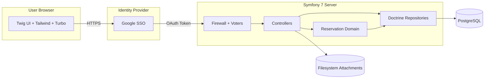
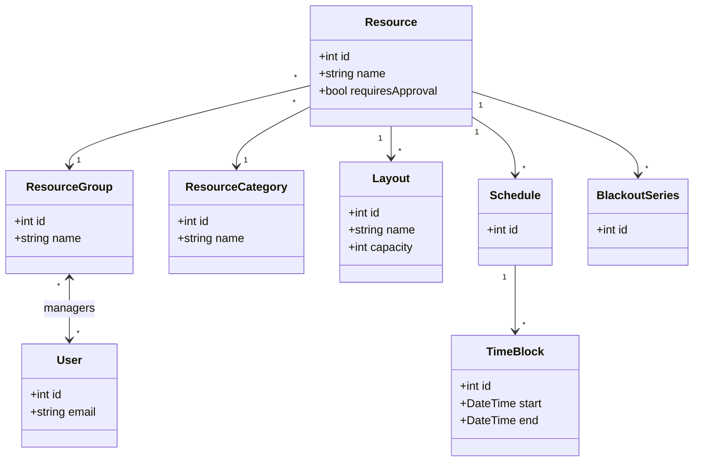
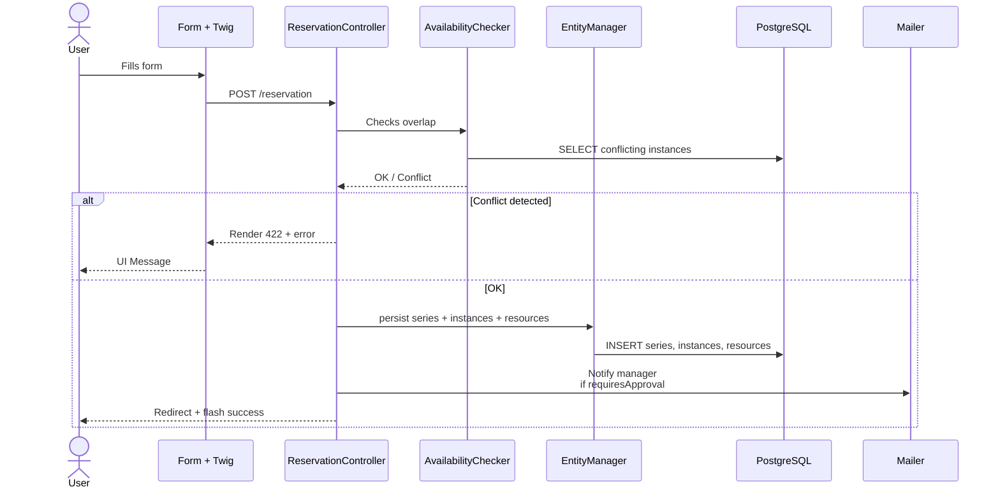
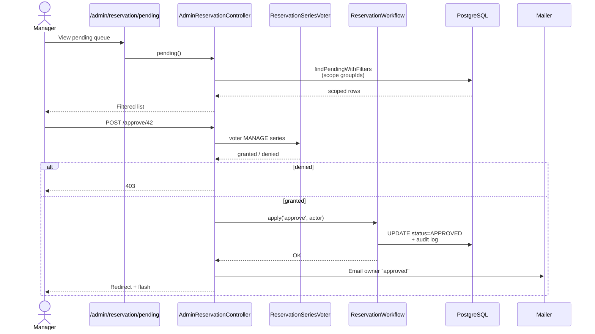

# Librebooking — Architecture & Overview

> **Target Audience**: Developers, Project Managers, Technical Leads.
> **Status**: Living document. Any structural evolution must be reflected here before merging.

---

## 1. Purpose of Librebooking

`Librebooking` is a **physical resource reservation** application. It replaces and consolidates spreadsheets, emails, and shared calendars historically used to book **meeting rooms**, **amphitheaters**, **vehicles**, and any other physical resource where concurrent allocation is an issue.

What falls under `Librebooking`:

- Declaring a physical resource (room, vehicle, etc.), attaching it to a group, associating it with opening slots, layouts, and approval rules.
- Allowing a user to **request** a slot for one or multiple resources, optionally on a recurring basis, with file attachments.
- Allowing a resource manager to **approve or reject** the request, within their specific scope (an amphitheater manager neither sees nor touches vehicle requests).

---

## 2. Origin of the Data Model

The database schema of `Librebooking` **was not designed from scratch**: it is based on the legacy open-source project **phpScheduleIt / Booked**, a PHP room reservation tool widely used in universities and associations. The team has:

- Extracted the core table structures (`reservation_series`, `reservation_instances`, `reservation_resources`, `reservation_statuses`, etc.).
- **Re-implemented it in PostgreSQL** (Librebooking historically targeted MySQL).
- **Mapped it into Doctrine entities** for Symfony 7 integration.
- Extended it with new features: `ResourceGroup`, group-based scoping, attachments, audit logs, and blackout periods.

**Practical consequences to know:**

- Some fields are inherited: the `legacyid` property of `ReservationSeries` is used to find a migrated row from a historical Librebooking instance. It is `nullable` and can remain empty for natively created series.
- **IDs for `ReservationStatus`** (1/2/3/4) are **stable** values taken from the legacy model. Modifying them would break compatibility.
- Vocabulary (`Series`, `Instance`, `Resource`) reflects the original terminology.
- The schema was designed with a specific logic: reservation of physical resources allocated over time slots. Modifying it to fit an entirely different domain would break its consistency.

---

## 3. Structural Constraints

Several constraints govern all subsequent choices:

**Authentication.** The application supports two complementary mechanisms: a **local account system** (email / password, hashed via Symfony's password hasher and authenticated through `form_login`) and **Google OAuth2 SSO** (`App\Security\GoogleAuthenticator`, via KnpUOAuth2ClientBundle). An organization can rely on either or both. SSO removes the need to manage passwords; the local system keeps the app usable without an external identity provider.

**Tailwind CSS.** The interface uses **Tailwind CSS v4** to ensure a modern, responsive, and easily maintainable design, fully supporting Dark Mode.

**Turbo Drive active.** Navigation uses Turbo (`symfony/ux-turbo`). This has two concrete consequences:
- Forms that return validation errors must respond with **HTTP 422**, otherwise Turbo ignores the response body.
- Scripts manipulating the DOM (e.g. FullCalendar) must live in the `body` and hook onto `turbo:load` / `turbo:before-cache` events to survive navigations.

**PostgreSQL.** The production database is PostgreSQL 16+. The schema is managed by Doctrine Migrations.

---

## 4. Technical Stack

| Layer | Choice | Version | Justification |
|---|---|---|---|
| Language | PHP | 8.4+ | Required by Symfony 7.4; native types, readonly properties, attributes. |
| Framework | Symfony | 7.4.* (LTS) | Official LTS version. Stable ecosystem. |
| ORM | Doctrine ORM | 3.6 | Symfony standard, migrations, QueryBuilder. |
| DBMS | PostgreSQL | 16+ | Reliability, integrity constraints, transaction support. |
| SSO | Google OAuth2 | — | Standard OAuth2 integration via KnpUOAuth2ClientBundle. |
| Front | Twig + Turbo + Stimulus | Turbo 2 | Fluid navigation, minimal JS, server-side rendering. |
| Design | Tailwind CSS | v4 | Modern styling, dark mode, responsive. |
| Calendar | FullCalendar | 6+ | Interactive rendering. |

---

## 5. Overview



The application exposes no public API. Existing `/api/*` endpoints are reserved for internal AJAX calls (calendar, availability).

---

## 6. Domain Model

The domain is divided into several **bounded contexts**:

- **Reservation**: Requesting and approving the use of a resource over a time slot.
- **Resource**: Catalog of rooms, vehicles, etc., with their groups, categories, and layouts.
- **Users & Roles**: Lightweight view, identity comes from Google SSO.

### 6.1 Reservation Context


**Key concept**: A **Series** is ONE request. **Instances** are the concrete time slots (a weekly reservation over 10 weeks = 10 instances). **ReservationResource** is the join table to the reserved resources. The status is held at the Series level (not the instance) — the entire request is approved or rejected as a whole.

**Business rule**: A Series targets resources **from a single group** (no mixing amphitheaters and vehicles in the same request). This rule simplifies voters and must be preserved.

### 6.2 Resource Context



**Key concept**: `ResourceGroup` is the pivot for administrative **scope**. A user with `ROLE_ADMIN_RESSOURCE` can only manage resources belonging to groups they are attached to. This allows separating "room" admins from "vehicle" admins.

---

## 7. Roles and Authorizations

### 7.1 Role Hierarchy

Defined in `config/packages/security.yaml`:

```yaml
role_hierarchy:
    ROLE_ADMIN_RESSOURCE: [ ]                        # Manages THEIR resources
    ROLE_SUPER_ADMIN:
        - ROLE_ADMIN
        - ROLE_ADMIN_RESSOURCE
        - ROLE_ALLOWED_TO_SWITCH
```

`ROLE_ADMIN_RESSOURCE` **does not inherit** from `ROLE_ADMIN`: this is intentional. This prevents a room manager from accessing the user list or global configuration.

### 7.2 Two Layers of Defense

The project systematically applies **two independent guards**:

**Layer 1 — Firewall / `access_control`**: Broad, at the URL level. Prevents an unauthenticated user or a user with insufficient roles from reaching the route. Configured in `security.yaml`.

**Layer 2 — Application Voters**: Fine-grained, at the object level. Once the route is reached, the voter decides on the specific instance (e.g., "Can this user manage this specific reservation series?"). Located in `src/Security/Voter/`.

---

## 8. Scope via `ResourceGroup` — The Invariant

This is the mechanism ensuring an amphitheater manager cannot approve a vehicle request. It relies on the existing `ManyToMany` relationship between `User` and `ResourceGroup`.

### 8.1 Read (Listings)

In the index and pending queue methods of the `AdminReservationController`, the set of group IDs for the user is calculated via `scopedGroupIds()`:

- Returns `null` for a `ROLE_SUPER_ADMIN` → no filter added, they see everything.
- Returns `[]` for a resource admin with no groups → the `IN ()` filter matches nothing → they see nothing (fail-safe).
- Returns `[id, …]` otherwise → `WHERE resource.resourceGroup IN (:ids)` is added to the repository.

### 8.2 Write (Actions on an object)

For `show`, `download`, `approve`, `reject`, `cancel`, evaluation is delegated to two voters:

- `ReservationSeriesVoter::VIEW_DETAILS` — the owner OR a manager of the group.
- `ReservationSeriesVoter::MANAGE` — super-admin OR manager of at least one group associated with a resource in the series.

---

## 9. Main Business Flows

### 9.1 Create a Reservation



### 9.2 Validate a Request



The rejection reason is **persisted in `reservation_audit_logs`** (not in the series itself), preserving the history if the series evolves.

---

## 10. Audit and Traceability

Every state change of a series leaves a trace in `reservation_audit_logs`:

- `action`: `approve`, `reject`, `cancel`, `create`, …
- `actor`: the user who triggered the action
- `reason`: free text reason (mandatory on `reject`)
- `at`: immutable timestamp

This audit is the source of truth to answer "who rejected this reservation?". It must never be edited retrospectively.

---

## 11. Code Tree

```text
src/
├── Controller/         HTTP Controllers, one per context
├── Domain/
│   └── Reservation/    Business services: Workflow, Availability, Checker
├── Entity/             Doctrine Entities (one class per table)
├── Form/               Form Types
├── Repository/         Doctrine Repositories
├── Security/
│   ├── GoogleAuthenticator.php
│   └── Voter/          ResourceVoter, ReservationSeriesVoter
├── Service/            Cross-cutting services
└── Twig/               Custom Twig extensions

config/
├── packages/           Bundle configurations (security.yaml first)
├── routes/             YAML routes complementing PHP attributes
└── services.yaml       DI wiring

migrations/             Doctrine Migrations
templates/              Twig templates
assets/                 JS/CSS sources (Tailwind CSS)
public/                 Web root
```
